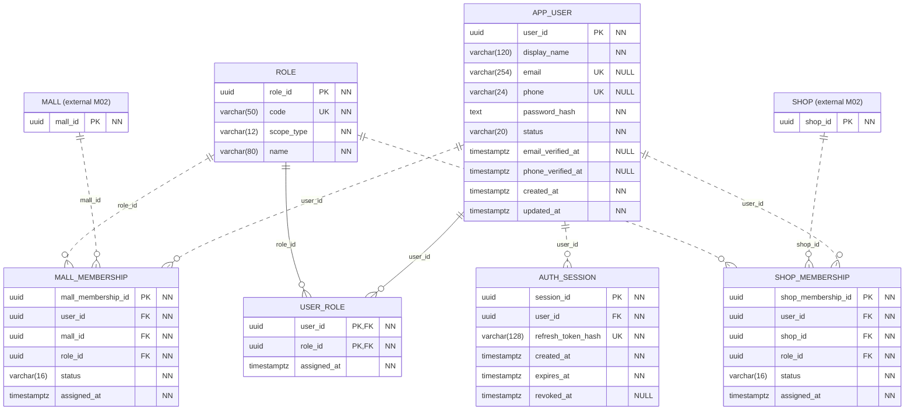

# Accounts and Access: complete module ER diagram

Users, scoped roles, memberships, and login sessions.

External entities display their primary keys only and are owned by the indicated module. All attributes of this module are shown. Relationship labels name the foreign-key field on the child.

See [data dictionary](DATA-DICTIONARY.md) and [business rules](BUSINESS-RULES.md) for checks that a diagram cannot express.
